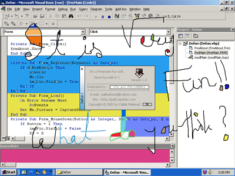



## Fun with the Screen \[Defun v1\.0\]

### Description

It is a fun soft that coded very simply,

Just run it and draw any thing you want in the screen.

And then right click to fill with random colour.

It's tiny and funny!!!!Have fun!
 
### More Info
 

             |
---                |---
**Submitted On**   |2002-07-13 15:17:32
**By**             |[Pallab Mahmud](https://github.com/Planet-Source-Code/PSCIndex/blob/master/ByAuthor/pallab-mahmud.md)
**Level**          |Beginner
**User Rating**    |5.0 (15 globes from 3 users)
**Compatibility**  |VB 6\.0
**Category**       |[Complete Applications](https://github.com/Planet-Source-Code/PSCIndex/blob/master/ByCategory/complete-applications__1-27.md)
**World**          |[Visual Basic](https://github.com/Planet-Source-Code/PSCIndex/blob/master/ByWorld/visual-basic.md)
**Archive File**   |[Fun\_with\_t1056667132002\.zip](https://github.com/Planet-Source-Code/pallab-mahmud-fun-with-the-screen-defun-v1-0__1-36860/archive/master.zip)

